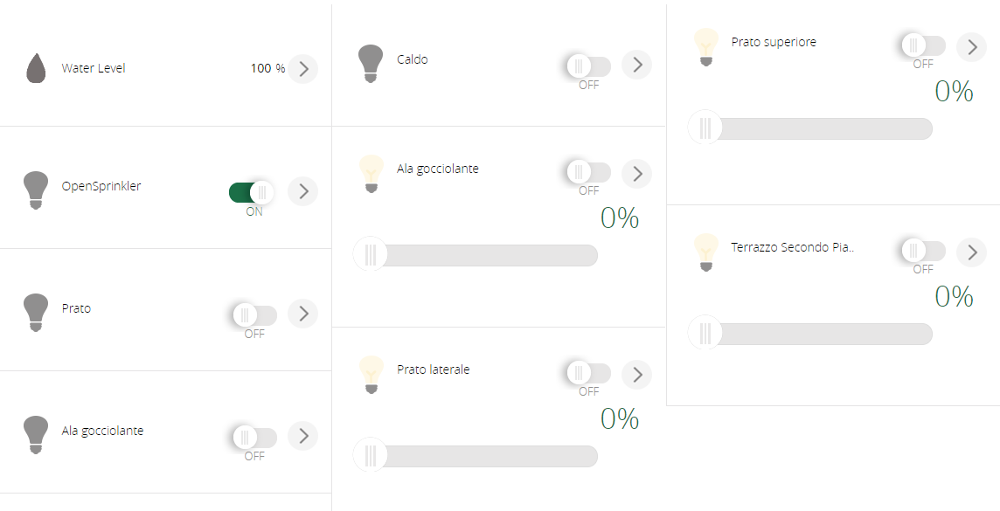

# OpenSprinkler plug-in for Vera
Completely new and rewritten plug-in to interface an OpenSprinkler to a Vera system.
It is able to discrovery and control:
- Programs (turn on/off)
- Zones (turn on/off, length in minutes using a dimmer)
- Rain Delay (sensor coming soon)

All the devices are implemented as standard Vera device types.

In particular, I need help with
- controller with a lot of zones (16/32+)
- controller with master valve
- controller with rain sensors
- support for scenes

# Installation via MiOS App Store
The files are available via MiOS App Store. Plug-in ID is 9301 if you want to install it manually.
Go to your Vera web interface, then Apps, Install Apps and search for "Vera OpenSprinkler Plug-in". Click Details, then Install.

# Manual Installation
To install, simply upload the files in this directory (except readme) using Vera's feature (Go to *Apps*, then *Develop Apps*, then *Luup files* and select *Upload*) and then create a new device under Vera.
To create a new device, got to *Apps*, then *Develops*, then *Create device*.
Every time you want to map a new controller, just repeat this operation.

- Device Type: *urn:schemas-upnp-org:device:BinaryLight:1*
- Upnp Device Filename/Device File: *D_VeraOpenSprinkler1.xml*
- Upnp Implementation Filename/Implementation file: *I_VeraOpenSprinkler1.xml*
- IP address: the OpenSprinkler Controller internal IP address (host name not supported)
- Parent Device: none

After installation, ensure to change the "IP" variable under the master device (if not specified before).
Password is set to "opendoor" (in MD5 format), but you need to change it (see next part).
Reload your Vera's engine and wait for you zones and programs to appear.

# Password
OpenSprinkler use MD5-hashed passwords. Ensure to use a tool (such as http://www.md5.cz/) and save the generated password in the corresponding variable.

# Variables
## For master device
- *urn:bochicchio-com:serviceId:OpenSprinkler1* / *DebugMode*: set to 1 to have verbose logging
- *urn:bochicchio-com:serviceId:OpenSprinkler1* / *Password*: set your MD5 password (default is *opendoor*, already setup at startup)

## For zones and programs
- *urn:bochicchio-com:serviceId:OpenSprinkler1* / *UpdateNameFromController*: 0 if you want to override the device name and never sync it with controller, 1 to sync it if changed (default)

## For Water Level
- *urn:micasaverde-com:serviceId:HumiditySensor1* / *CurrentLevel*: if you want to get the water level from the device

# Use in code
Master, Zones and Program devices implements standard switch action: *urn:upnp-org:serviceId:SwitchPower1 SetTarget*
Master, Zones and Program devices implements standard HA action for toggle state: *urn:micasaverde-com:serviceId:HaDevice1 ToggleState*
Zone devices implements standard dimmers action: *urn:upnp-org:serviceId:SwitchPower1 SetTarget*
Master device has support to set Rain Delay via *urn:bochicchio-com:serviceId:OpenSprinkler1 SetRainDelay* passing *newRainDelay* (date and time in epoch format)

# Discovery of new devices
Starting from version 1.3, discovery of devices is done only on first run. If you want to force it again, set *Configured* to *0*.

# OpenLuup/ALTUI
The devices are working and supported under OpenLuup and ALTUI. In this case, if you're using an old version, just be sure the get the base service file from Vera (automatically done if you have the Vera Bridge installed).

# Support
If you need more help, please post it on Vera's forum and tag me (@therealdb).